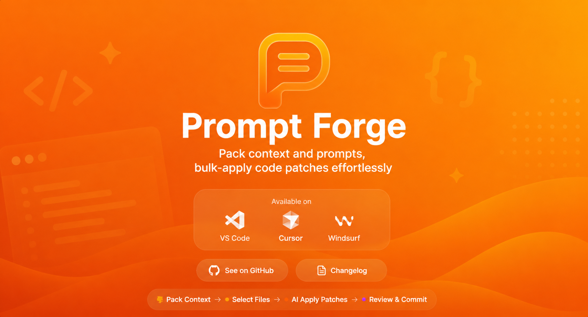

# Prompt Forge

  

Pack context and prompts, bulk-apply code patches effortlessly

> **Forked from [mnismt/overwrite](https://github.com/mnismt/overwrite)**

## Install

- For VSCode (VSCode Marketplace): <https://marketplace.visualstudio.com/items?itemName=namnp19.prompt-forge>
- For Cursor/Windsurf (OpenVSX): <https://open-vsx.org/extension/namnp19/prompt-forge>

## Features

- **Explorer**
  - Select files/folders with search and refresh; double‑click to open files.
  - Token counting per file and folder rollups; multi‑root workspaces supported.
  - Skipped files report (binary, too-large, or error) shown inline.

- **Context**
  - Write user instructions with a resizable textarea.
  - Save and load reusable prompts (named prompt library).
  - Toggle **Code** / **Plan** mode before copying:
    - *Code* — AI writes code directly.
    - *Plan* — AI plans first, asks clarifying questions, then waits for approval.
  - Copy XML with `<file_map>`, `<file_contents>`, `<user_instructions>`, optionally `<xml_formatting_instructions>`.
  - Live token stats (files + instructions + XML overhead) shown in a fixed footer.

- **Apply**
  - Paste LLM XML response and preview diffs (create / modify / rewrite / delete / rename) before applying.
  - Live XML lint and auto-normalization with inline warnings.
  - Per-row preview and apply — handle individual changes independently.
  - Apply safely via VS Code APIs with full undo/redo support and clear error feedback.

- **Settings**
  - Excluded folders editor.
  - Privacy-preserving telemetry controls.

## How to use

1. Open **Prompt Forge** from the Activity Bar.
2. In the **Context** tab, pick files from the explorer, choose a mode (Code or Plan), and enter your task instructions.
3. Optionally save the instructions as a named prompt for reuse.
4. Click **Copy Context** (or **Copy Context + XML Instructions**) and paste into your LLM.
5. Paste the LLM XML response into the **Apply** tab, preview the diffs, then apply all or row-by-row.

## Privacy & Telemetry

Prompt Forge includes **optional, anonymous telemetry** to help improve the extension. We collect usage patterns and performance metrics while maintaining strict privacy:

- **Anonymous data only** - No file paths, contents, or personal information
- **Transparent implementation** - All telemetry code is open source
- **Easy opt-out** - Disable via VS Code settings (`promptforge.telemetry.enabled`)

For complete details, see [TELEMETRY.md](TELEMETRY.md).

## Requirements

- VS Code 1.85.0+

## Acknowledgments

- Forked from [mnismt/overwrite](https://github.com/mnismt/overwrite)
- Originally inspired by [RepoPrompt](https://repoprompt.com/) by @provencher
